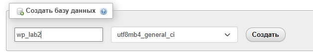
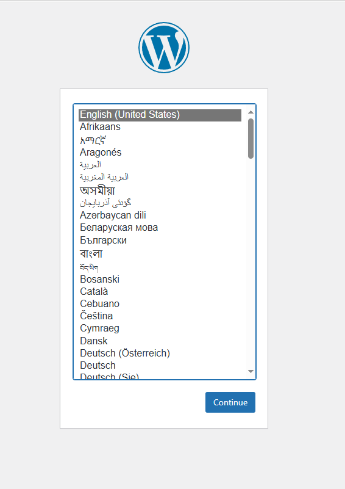
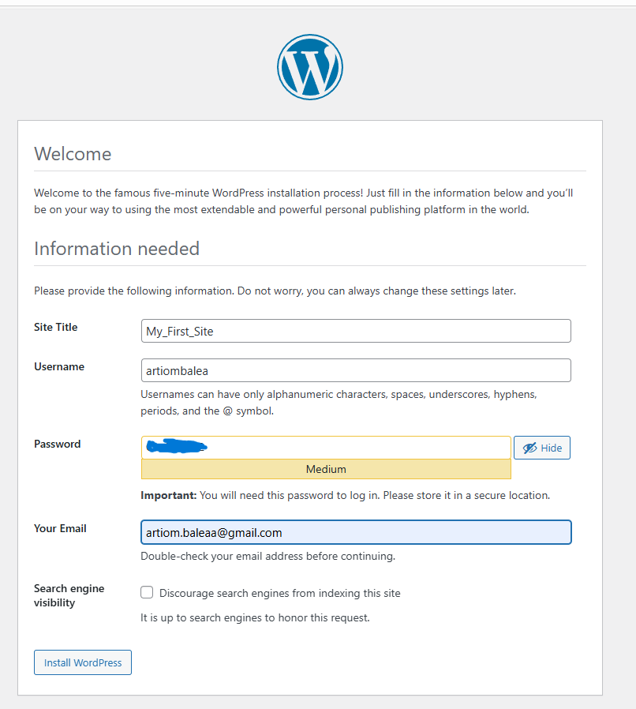
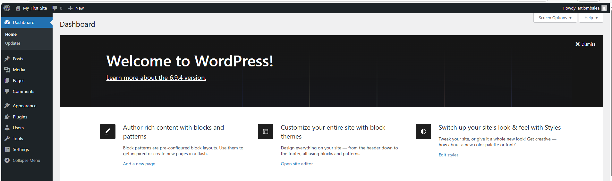
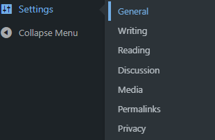
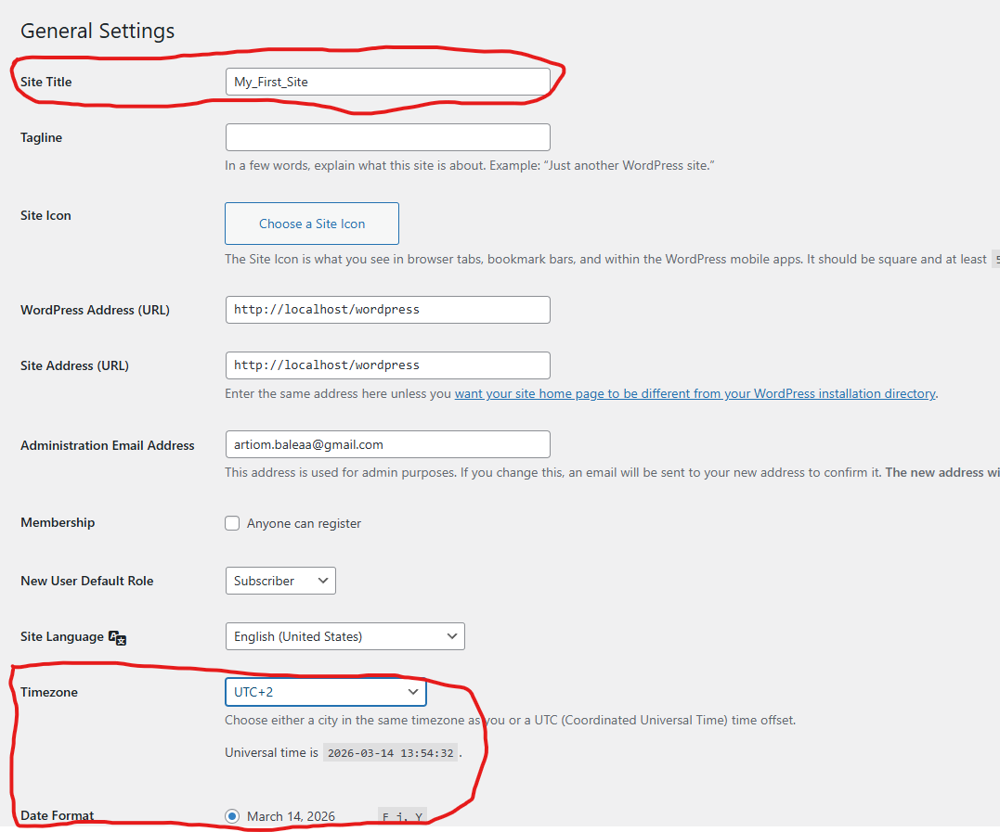
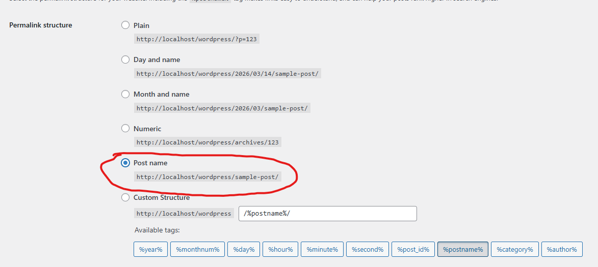

# Lucrarea de laborator nr. 2. Introducere în WordPress

## Scopul lucrării

Să înveți cum să instalezi WordPress într-un mediu local, să te familiarizezi cu panoul de administrare, să modifici aspectul site-ului prin teme și să extinzi funcționalitatea acestuia cu ajutorul plugin-urilor.

## Condiții

###  Pasul 1. Pregătirea mediului

1.Instalează XAMPP de pe linkul https://sourceforge.net/projects/xampp/

2.Pornește modulele Apache și MySQL. Asigură-te că http://localhost se deschide.

3.În phpMyAdmin, creează o bază de date nouă, de exemplu wp_lab2

### Pasul 2. Instalarea WordPress

1.Descarcă WordPress de pe wordpress.org

2.Dezarhivează fișierele în folderul htdocs

3.În browser, deschide http://localhost/wordpress și parcurge procesul de instalare introducand toate datele necesare 

Alegem limba instalarii

Introducem datele necesare

Pornim instalarea 

Alegem titlul si cream cont 

Ne logam si intram in pagina principala

### Pasul 3. Setările inițiale ale site-ului

1.În panoul de administrare, accesează secțiunea Settings → General. Schimbă numele site-ului și fusul orar.

2.În Settings → Permalinks, selectează opțiunea Post name pentru link-uri mai prietenoase.

### Pasul 4. Lucrul cu teme

1.Deschide secțiunea Appearance → Themes.

2.Instalează o temă nouă din catalogul oficial (de exemplu, „Astra”).
